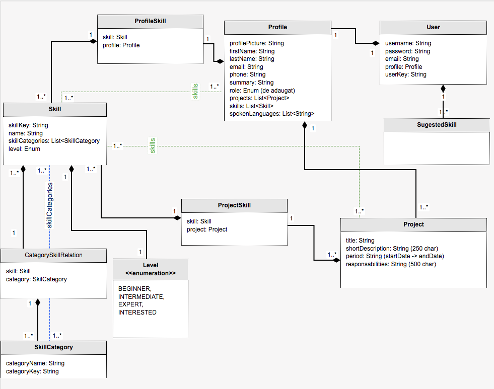

# Avangarde HR Portal - Profile Service

### ❄ Live Application

The project is live at http://46.101.179.148:8082

Prerequisites:
---------------

* [Java 8](https://openjdk.java.net/install/)
* [Maven](https://maven.apache.org/)

### ❄ API Description

This is an Undertow based server integrated with Spring and JaxRS. With a PostgreSQL Database.

This API servers as a microservice for Avangarde's HR Portal. It's role is to allow employees to create their Profile and generate a CV based on it. It allows them to put their skill and the projects their worked on, update them and then quickly generate a CV updated according to their changes.

### ❄ Domain Model

### ❄ Endpoints

Visit http://localhost:8082/apidoc or http://46.101.179.148:8082/apidoc/ to see the endpoints.

### 🌀 Build and run
Build
---------------
* Get the latest version from the Git repository
* Run: `mvn clean install` on the root directory

Run
---------------
* Go to the `essentialprogramming-api/target` directory after building the application.
* Run: `java -jar essentialprogramming-api-1.0.0-SNAPSHOT.jar`

** Alternatively, if you open the project with an IDE, you can also run the Server.java file
located in `essentialprogramming-api/src/main/java/com/server`

### 🌀 DB Migration
`mvn compile flyway:baseline; `

`mvn compile flyway:migrate; `
